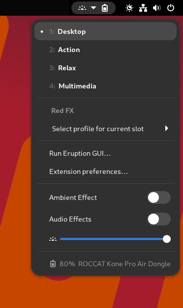
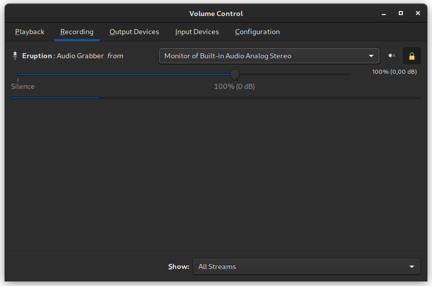

[](https://copr.fedorainfracloud.org/coprs/x3n0m0rph59/eruption/package/eruption/)


# Table of Contents

- [Table of Contents](#table-of-contents)
  - [Eruption](#eruption)
  - [Supported Devices](#supported-devices)
    - [Keyboard Devices](#keyboard-devices)
    - [Mouse Devices](#mouse-devices)
    - [Miscellaneous Devices](#miscellaneous-devices)
  - [Important Information](#important-information)
  - [Design Overview](#design-overview)
    - [Introduction](#introduction)
    - [Systems Architecture](#systems-architecture)
  - [Installation](#installation)
    - [Arch Linux and derivatives like ArcoLinux or Manjaro](#arch-linux-and-derivatives-like-arcolinux-or-manjaro)
    - [Fedora based](#fedora-based)
    - [Ubuntu or Pop!_OS](#ubuntu-or-pop_os)
    - [From Source](#from-source)
  - [After Setup](#after-setup)
    - [Support for Audio Playback and Capture](#support-for-audio-playback-and-capture)
  - [The `eruption-audio-proxy` Daemon](#the-eruption-audio-proxy-daemon)
  - [The `eruption-process-monitor` Daemon](#the-eruption-process-monitor-daemon)
    - [Examples](#examples)
    - [Removing a rule](#removing-a-rule)
  - [Further Reading](#further-reading)
    - [Features Overview (a.k.a The Eruption Handbook)](#features-overview-aka-the-eruption-handbook)
    - [Other Documentation](#other-documentation)
  - [HOWTOs](#howtos)
  - [FAQs](#faqs)
  - [Contributing](#contributing)

---

## Eruption

A Linux user-mode input and LED driver for keyboards, mice and other devices

[](https://www.youtube.com/watch?v=ig_71zg14nQ)

---

## Supported Devices

### Keyboard Devices

- ROCCAT Vulcan 100/12x series keyboard (fully supported, stable)
- ROCCAT Vulcan Pro TKL series keyboard (98% supported as of version `0.1.19`, testing)
- ROCCAT Vulcan TKL series keyboard (work-in-progress, as of version `0.1.20`, experimental, untested)
- ROCCAT Vulcan Pro series keyboard (work-in-progress, as of version `0.1.20`, experimental, untested)
- ROCCAT Magma series keyboard (work-in-progress, as of version `0.1.23`, experimental)
- Corsair Strafe Gaming Keyboard (non-RGB/monochrome only, as of version `0.1.20`, experimental)

### Mouse Devices

- ROCCAT Kone Pure Ultra (stable)
- ROCCAT Burst Pro (as of version `0.1.20`, testing)
- ROCCAT Kain 100 AIMO (as of version `0.1.24`, experimental)
- ROCCAT Kain 2xx AIMO (as of version `0.1.23`, testing)
- ROCCAT Kone Pro Air (work-in-progress, as of version `0.1.24`, experimental)
- ROCCAT Kone Aimo (experimental)
- ROCCAT Kone Aimo Remastered (experimental)
- ROCCAT Kova AIMO (testing)
- ROCCAT Kova 2016 (as of version `0.1.23`, testing)

### Miscellaneous Devices

- ROCCAT/Turtle Beach Elo 7.1 Air Wireless Headset (work-in-progress, as of version `0.1.23`, testing)
- ROCCAT Sense AIMO XXL (as of version `0.1.23`, stable)
- Adalight/Custom serial LEDs (testing)

Please see [DEVICES.md](DEVICES.md) for further information

## Important Information

This project is still in an early stage of development, and thus may contain some possibly serious bugs.

If you ever need to forcefully disable the Eruption daemon you may do so by adding
the following text snippet to the bootloader's (e.g. GRUB) kernel command line:

```shell
systemd.mask=eruption.service
```

Or with systemctl to mask the service:

```shell
sudo systemctl mask eruption.service
```

You can always re-enable the Eruption service with the command:

```shell
sudo systemctl unmask eruption.service
```

---

## Design Overview

### Introduction

Eruption is a Linux daemon written in the Rust programming language. Eruption consists of a core daemon with an integrated
Lua interpreter, and additional plugin components. Its intended usage is to execute Lua scripts that may react to certain
events on the system like e.g. `Timer tick`, `Key pressed` or `Mouse moved` and subsequently control the connected LED
devices and/or transform the user input via the integrated programmable macro feature.
Eruption plugins may export additional functionality to the Lua scripting engine. Multiple Lua scripts may be run in
parallel, each one in its own VM thread. A Lua script shall compute some kind of effect resulting in a 'color map'.
Each Lua scripts 'submitted color map' will be combined with all other scripts 'submitted color maps' using a compositor
that performs an alpha blending step on each 'color map' before it finally gets sent to the connected LED devices.

### Systems Architecture

Eruption is split into multiple independent processes: `eruption`, the core daemon that handles hardware access running 
as `root`, and multiple session daemons, most notably `eruption-audio-proxy` that provides audio related functionality
to the core daemon, and `eruption-process-monitor` that is able to automatically switch profiles based on system
usage. Both of these session daemons run as the respective logged-in user.

---

## Installation

> To install the latest git snapshot please use the package named `eruption-git` instead of the stable package `eruption`

### Arch Linux and derivatives like ArcoLinux or Manjaro

```shell
paru -Syu aur/eruption

systemctl --user enable --now eruption-audio-proxy.service
systemctl --user enable --now eruption-process-monitor.service

sudo systemctl enable --now eruption.service
```

### Fedora based

```shell
sudo dnf copr enable x3n0m0rph59/eruption
sudo dnf install eruption

systemctl --user enable --now eruption-audio-proxy.service
systemctl --user enable --now eruption-process-monitor.service

sudo systemctl enable --now eruption.service
```

### Ubuntu or Pop!_OS

```shell
sudo add-apt-repository ppa:x3n0m0rph59/eruption
sudo apt update
sudo apt install eruption

systemctl --user enable --now eruption-audio-proxy.service
systemctl --user enable --now eruption-process-monitor.service

sudo systemctl enable --now eruption.service
```

### From Source

```shell
git clone https://github.com/X3n0m0rph59/eruption.git
cd eruption
make
sudo make install
make start
```

To remove Eruption from your system run:

```shell
make stop
sudo make uninstall
```

Please refer to [INSTALL.md](docs/INSTALL.md) for further information, e.g. the dependencies you need to install to be
able to successfully build Eruption from source.

---

## After Setup

> You may want to try the
[Eruption Profile Switcher](https://extensions.gnome.org/extension/2621/eruption-profile-switcher/)
GNOME Shell extension that enables easy switching of profiles on the fly




### Support for Audio Playback and Capture

Eruption currently has built-in support for the following audio APIs:

* `PipeWire` (via the `PulseAudio` interface of `PipeWire`)
* `PulseAudio`

Audio support is provided by `eruption-audio-proxy.service`.

## The `eruption-audio-proxy` Daemon

As of Eruption `0.1.23` it is no longer necessary to grant the `root` user full access to the `PipeWire` or `PulseAudio`
session instance. Therefore, it is no longer required to edit configuration files. Just enable the `eruption-audio-proxy`
session daemon and assign a device monitor to listen on, e.g. by using `pavucontrol`.

```shell
systemctl --user enable --now eruption-audio-proxy.service
```

> NOTE: Please _do not use `sudo`_ in front of the command since it has to act on the session instance of systemd

Next, switch to a profile that utilizes the audio API of Eruption:
```shell
eruptionctl switch profile spectrum-analyzer-swirl.profile
```

Then use `pavucontrol` to assign a monitor of an audio device to the Eruption audio grabber. 


> NOTE: You have to select a profile that makes use auf the audio grabber first, otherwise the
> `eruption-audio-proxy` will not open an audio device for recording, and therefore will not be listed

## The `eruption-process-monitor` Daemon

As of Eruption `0.1.19`, automatic switching of profiles and slots is supported via the `eruption-process-monitor`
daemon. It gathers data via multiple sensor plugins and matches this data against a rule engine.
It currently supports executing actions on process execution, as well as on Wayland or X11 "window focus changed" events.

### Examples

To enable the daemon please run the command:

`systemctl --user enable --now eruption-process-monitor.service`

To list all rules, run the command:

`eruption-process-monitor rules list`

Switch to `spectrum-analyzer-swirl.profile` when a YouTube tab is active in Google Chrome:

`eruption-process-monitor rules add window-name '.*YouTube.*Google Chrome' /var/lib/eruption/profiles/spectrum-analyzer-swirl.profile`

Switch to `profile3.profile` when a YouTube tab is active in Mozilla Firefox:

`eruption-process-monitor rules add window-name '.*YouTube.*Mozilla Firefox' /var/lib/eruption/profiles/profile3.profile`


To list all supported sensors and actions please run the command:

`eruption-process-monitor rules add help`

### Removing a rule

```shell
eruption-process-monitor rules list
  0: On window focused: Name: '.*YouTube.*Mozilla Firefox' => Switch to profile: /var/lib/eruption/profiles/spectrum-analyzer-swirl.profile (enabled: false, internal: false)
  1: On window focused: Name: 'Skype' => Switch to profile: /var/lib/eruption/profiles/vu-meter.profile (enabled: false, internal: false)
  2: On window focused: Name: 'Left 4 Dead 2.*' => Switch to profile: /var/lib/eruption/profiles/gaming.profile (enabled: true, internal: false)
  3: On window focused: Name: '.*YouTube.*Google Chrome' => Switch to profile: /var/lib/eruption/profiles/spectrum-analyzer-swirl.profile (enabled: true, internal: false)
  4: On window focused: Instance: '.*' => Switch to profile: /var/lib/eruption/profiles/profile1.profile (enabled: true, internal: true)
```

To remove a rule, please run the following command:

```shell
eruption-process-monitor rules remove 1
```
> This will remove the rule for the window named `Skype` from the ruleset.

---

## Further Reading

### Features Overview (a.k.a The Eruption Handbook)

A general overview over the features of Eruption and how to use them

[FEATURES.md](docs/FEATURES.md)

### Other Documentation

Please see [DOCUMENTATION.md](docs/DOCUMENTATION.md) for a more thorough explanation of what Eruption is, and how to use
and customize it properly.

For further information about the supported Lua functions and libraries, please refer to the developer documentation
[LIBRARY.md](docs/LIBRARY.md).

For a detailed documentation on how to write your own macros, please refer to [MACROS.md](docs/MACROS.md)

## HOWTOs

Please find a list of HOWTOs at [HOWTO.md](docs/HOWTO.md)

## FAQs

Please find a list of frequently asked questions and their respective answers at [FAQs.md](docs/FAQs.md)

## Contributing

Contributions are welcome!
Please see `src/scripts/examples/*.lua` directory for Lua scripting examples.
