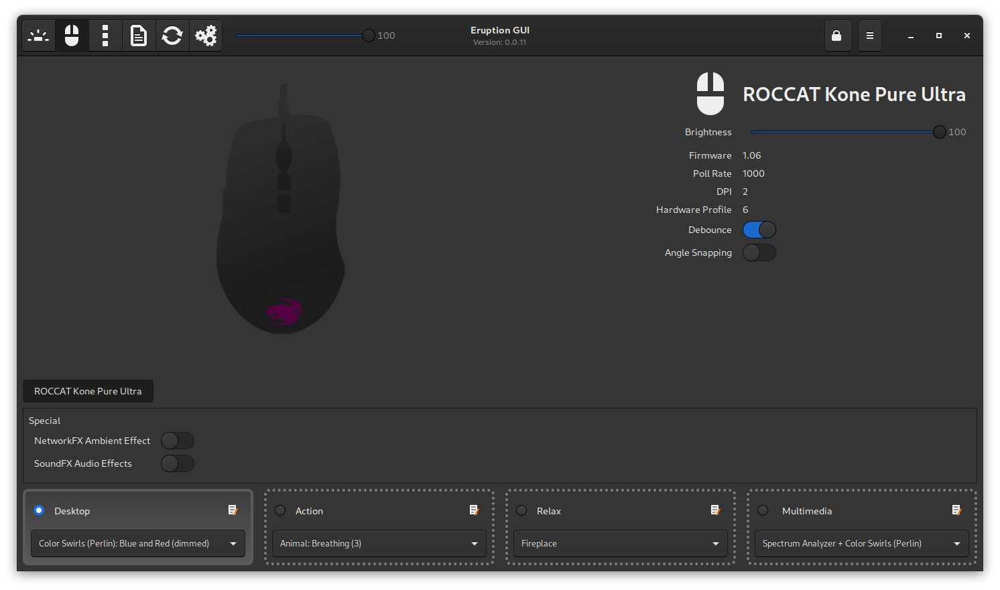
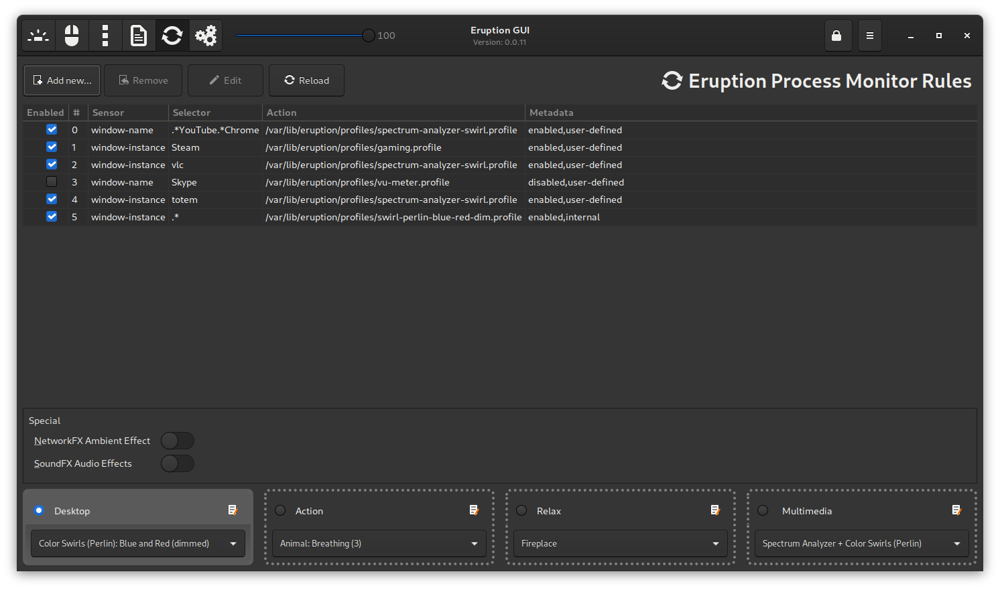

## eruption-gui-gtk3 - A GUI for the Eruption Linux user-mode driver

This is a technology preview version of the `Eruption GUI`, a GTK3+ based UI for Eruption

Please see also: [Pyroclasm UI](../pyroclasm/README.md)

